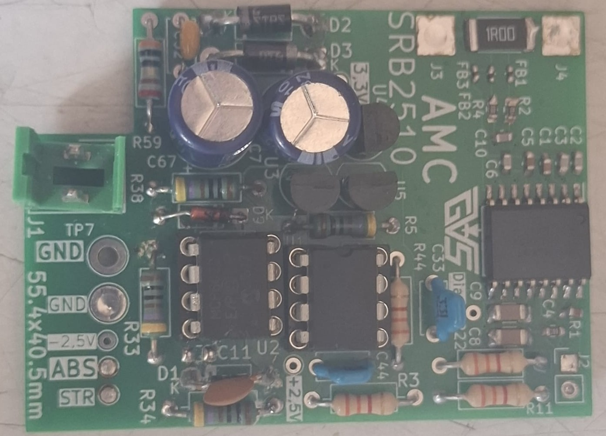
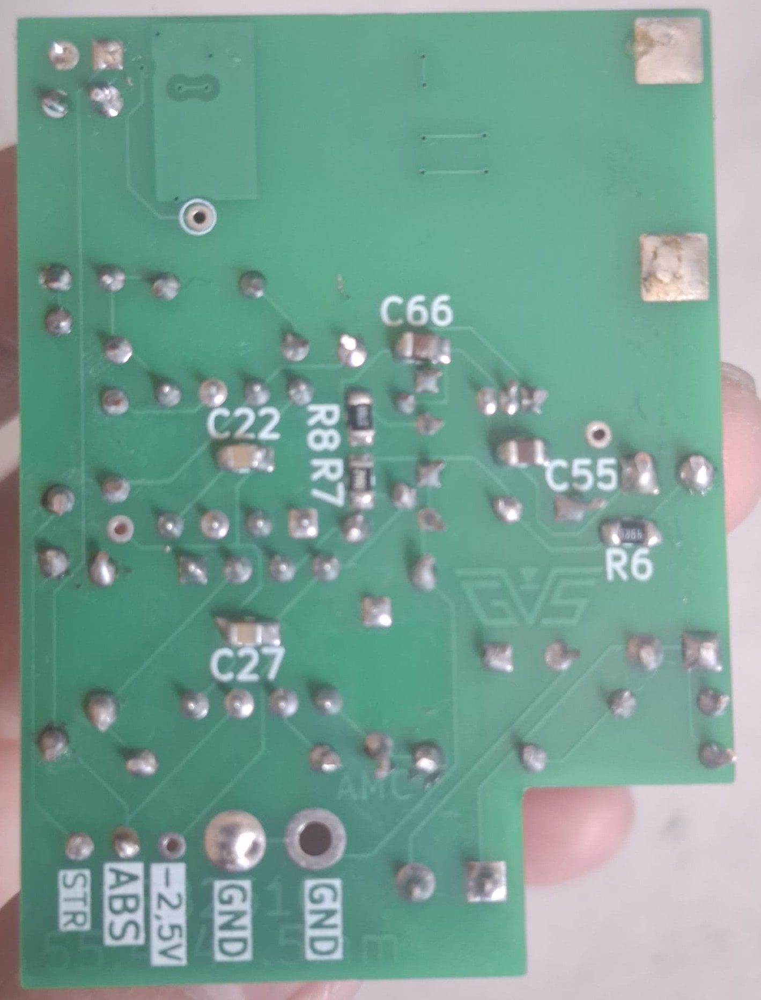
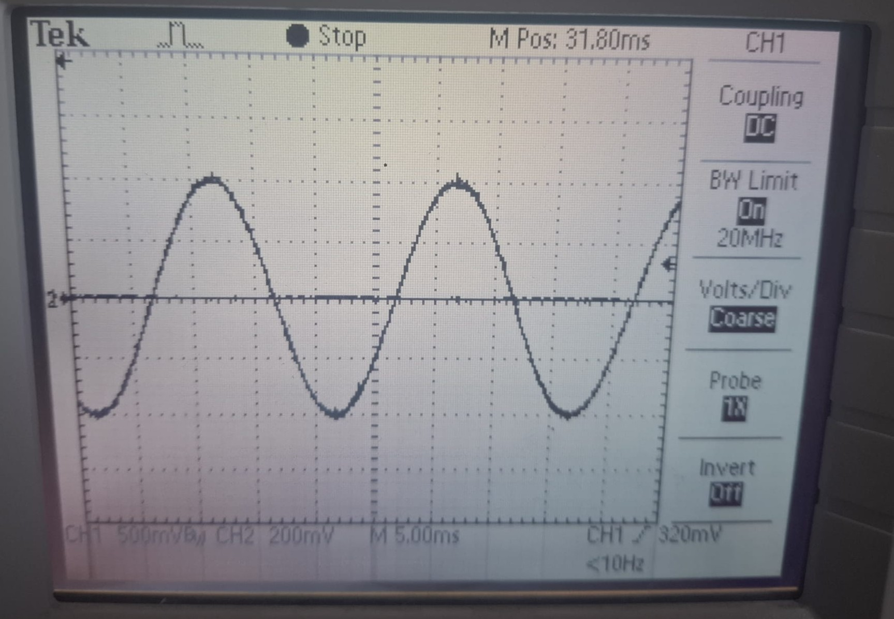
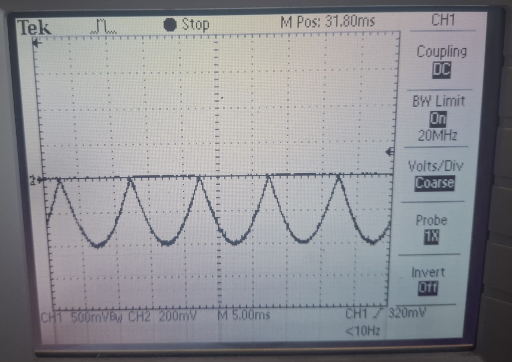
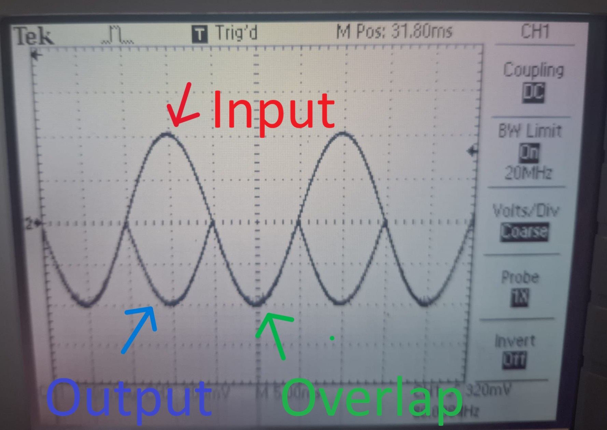

# AMC3302-Based Precision Full-Wave Rectifier PCB

## Description
Custom AMC3302-based full-wave rectifier PCB for AC signal measurement and conditioning.

## Overview
The input AC signal is measured using the AMC3302 isolated amplifier and further processed through a dual MCP6022 stage to produce a full-wave rectified output.

The system was iteratively tested and validated through signal measurement and analysis to ensure correct behavior and stable output.

## Hardware
- Custom PCB design  
- AMC3302 isolated amplifier  
- Dual MCP6022 operational amplifiers  
- LM78L05 voltage regulator  

**Images:**

- Empty PCB  

- Assembled PCB  

## Results
Signal verification through measurement:

- Input signal  

- Rectified output signal  

- Input vs Output comparison  

## Status
- Designed and assembled  
- Tested and validated through measurement  
- Functionality confirmed  

## Notes
Additional capacitors were introduced after testing to reduce noise and improve output signal stability.
